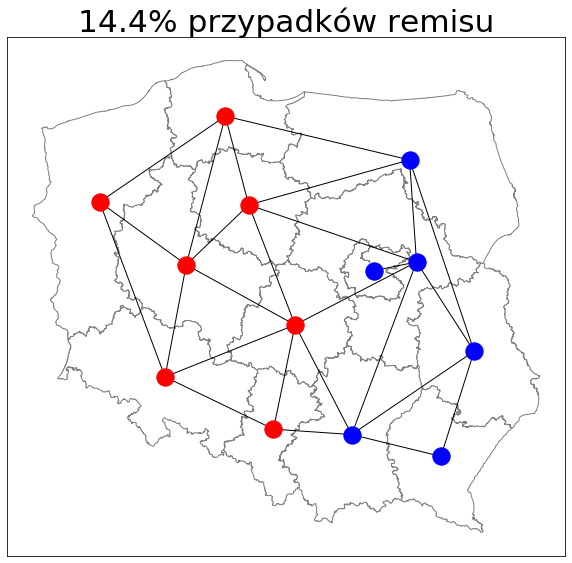
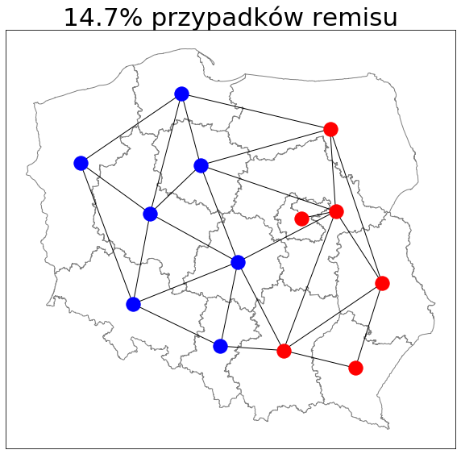
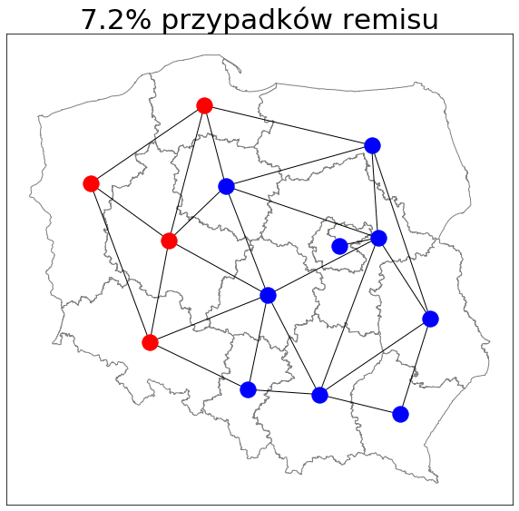
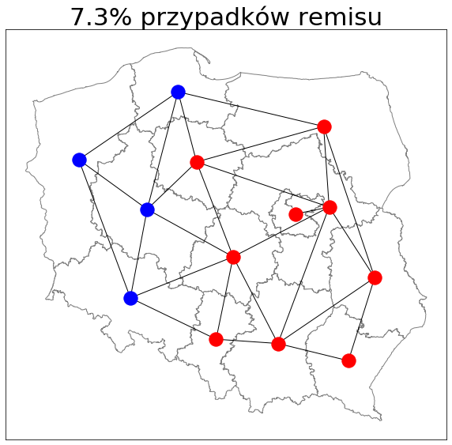

# Voter_model_Poland
Voter model with extra features - the goal is to simulate behaviour in Poland since 2005.

## Step 1:  
Project to model the voting situation in Poland for Europarlament Election (2004-2019). It is really easy model, with preferences of voting for one of two parties for each district. Finally we ended with 26 parameters, for 2 for each node, which are constant in time. The voer model used in this project is modified. In every time step the preferences of each node changed, depending on the neighbours' support for each paty.  
### Conclusions:  
1. The outcome of rundom support for each party is that, the 40% of situations ended with the domination of party A, the next 40% of the domination of party B and 20% of the results where no party dominates. The interesting fact is that the 43% of this 20% is the situation where Poland is divided on the West side and East side (just like in real life).

  
  
  
  

